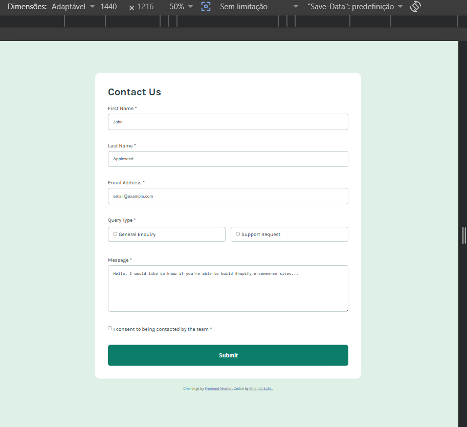
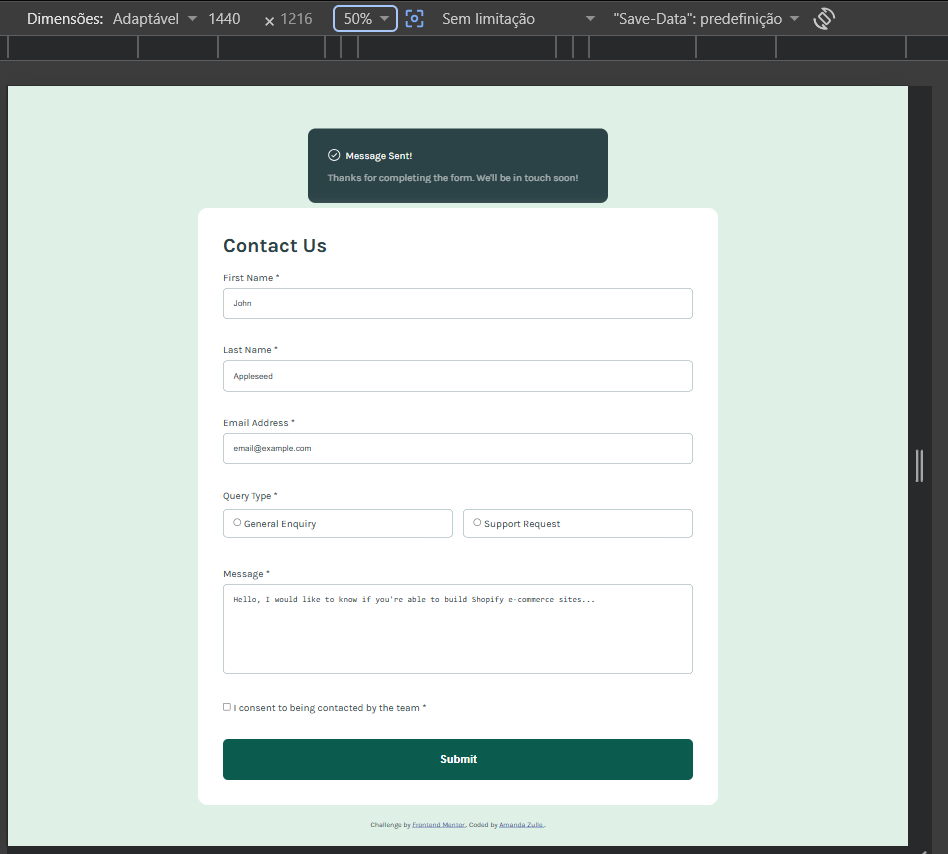
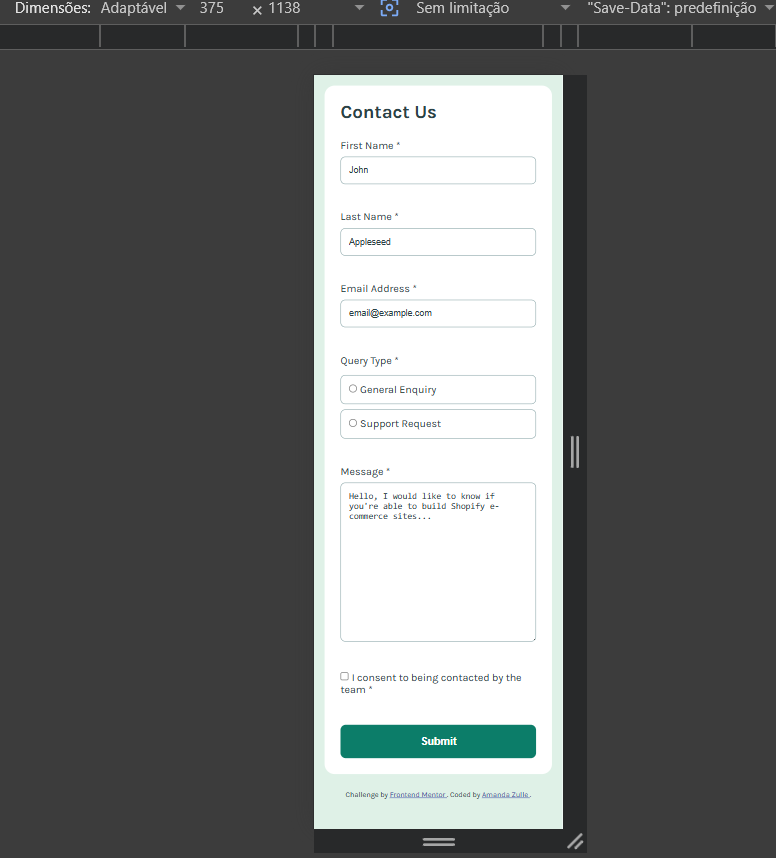

# formulario-de-contato-estudo

Esta é a minha solução para o desafio [Contact Form do Frontend Mentor](https://www.frontendmentor.io/challenges/contact-form--G-hYlqKJj).

O Frontend Mentor oferece desafios para praticar desenvolvimento frontend por meio da construção de projetos baseados em designs reais.

## Visão geral

### O desafio

O objetivo do projeto é construir um formulário de contato no qual os usuários possam:

* Preencher o formulário de contato
* Selecionar um tipo de consulta
* Informar nome, e-mail e mensagem
* Aceitar ser contactado pela equipe
* Receber mensagens de erro quando os campos obrigatórios não forem preenchidos corretamente
* Visualizar uma mensagem de sucesso após o envio do formulário
* Utilizar o formulário em diferentes tamanhos de tela

### Screenshot

## Tecnologias utilizadas

* HTML5
* CSS3
* JavaScript
* CSS Grid
* CSS Responsivo
* Validação de formulário

## Funcionalidades

* Formulário de contato responsivo
* Validação dos campos com JavaScript
* Validação de campos obrigatórios
* Validação do formato do e-mail
* Validação do tipo de consulta
* Validação do checkbox de consentimento
* Exibição de mensagens de erro
* Exibição de mensagem de sucesso após o envio
* Layout responsivo para diferentes tamanhos de tela
* Reutilização das regras de validação no JavaScript

## O que eu aprendi

Este projeto foi uma oportunidade para praticar e aprimorar meus conhecimentos de HTML, CSS e JavaScript enquanto desenvolvia uma interface a partir de um design fornecido, ainda tenho muito a aprender mas, valeu a pena.

Durante o desenvolvimento, pratiquei principalmente:

* Estruturação de formulários com HTML semântico
* Uso correto de `label` e elementos de formulário
* Uso de `fieldset` e `legend`
* Criação de layouts responsivos com CSS Grid
* Controle de espaçamentos e dimensões com CSS
* Estilização de campos de formulário
* Criação de estados visuais para elementos interativos
* Personalização de checkbox e radio buttons
* Validação de campos utilizando JavaScript
* Exibição e remoção de mensagens de erro
* Tratamento do envio do formulário com JavaScript
* Criação de uma mensagem de sucesso
* Reutilização de regras de validação para evitar código duplicado

Um dos principais aprendizados deste projeto foi entender a importância de fazer **uma alteração por vez, testar o resultado e comparar com o design original**.

Também pratiquei a organização e refatoração, centralizando regras de validação reutilizáveis em vez de repetir a mesma lógica em diferentes partes do código.

## Desenvolvimento futuro

Nos próximos projetos, pretendo continuar aprimorando:

* Fundamentos de JavaScript
* Técnicas de validação
* Acessibilidade
* Design responsivo
* Organização do CSS
* Legibilidade e manutenção do código

## Recursos utilizados

- [Frontend Mentor](https://www.frontendmentor.io/) — plataforma que disponibiliza o desafio.
- GPT e GitHub Copilot — ferramentas de apoio utilizadas durante o desenvolvimento para tirar dúvidas, compreender conceitos, revisar o código e resolver problemas.

## Autora

**Amanda Zulle**

* GitHub — [meu perfil](https://github.com/Amanda-Zulle)

